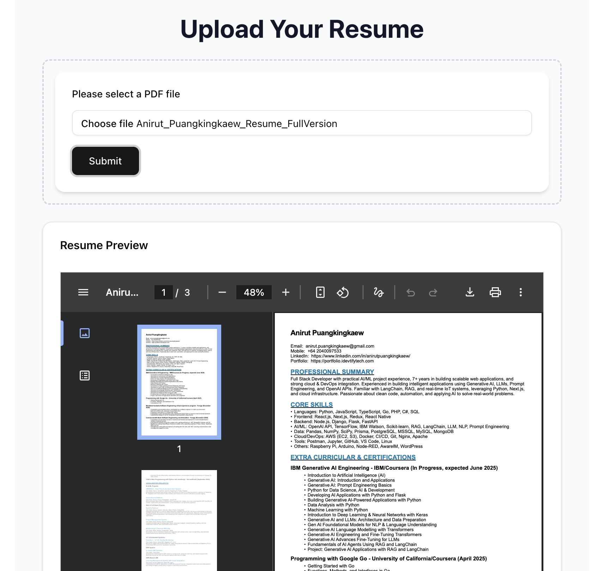
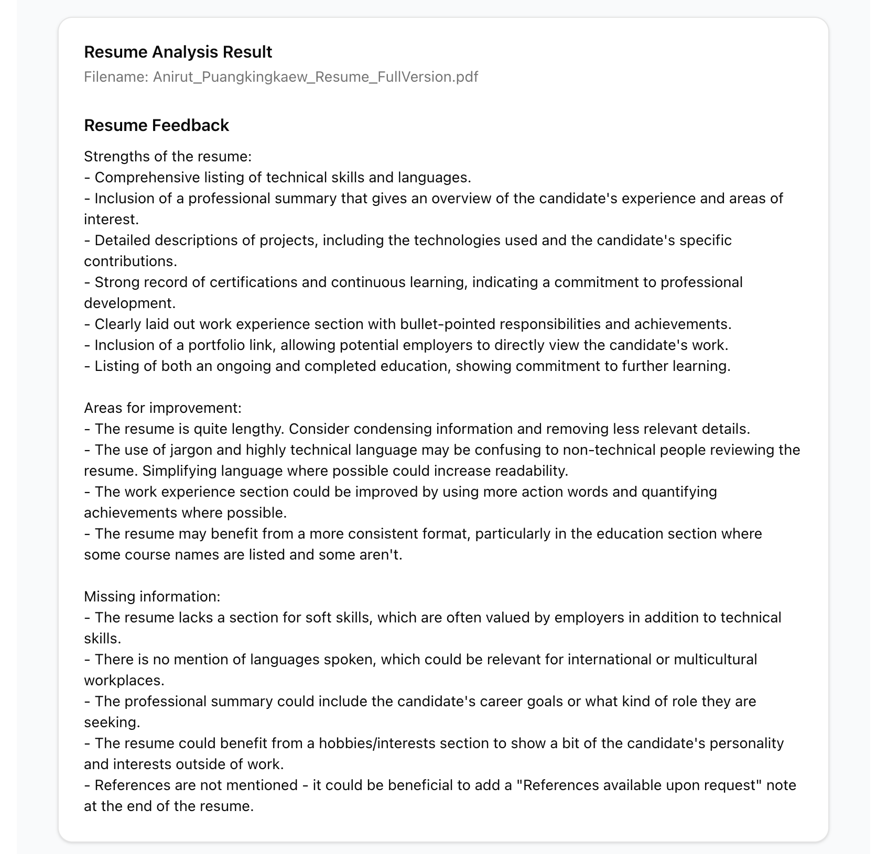
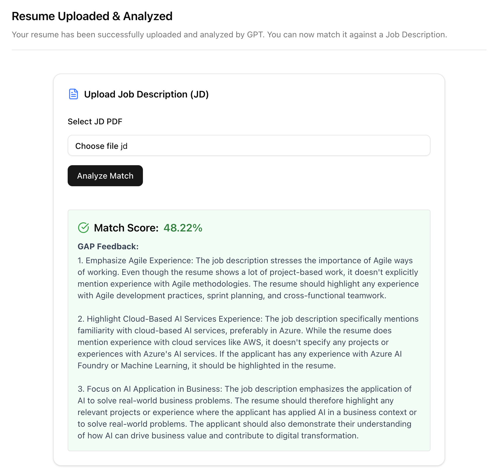

# AI Resume Analyzer

A GPT-powered application that analyzes resumes, matches them against job descriptions, and provides improvement suggestions — using semantic search and natural language generation.


---

---

## Screenshot Preview

Here's a quick look at the Resume Analyzer in action:

<div style="display: flex; gap: 10px;">
  
  
  
</div>

<div style="margin-top: 1rem;">
  
</div>

---

## Features

-   📄 Upload PDF resumes
-   🔍 Extract skills, experience, and education using NLP
-   📊 Match resume against job descriptions with similarity scoring
-   ✨ Get GPT-powered suggestions and GAP feedback for better alignment with job descriptions
-   📁 Upload JD and resume for AI-based compatibility matching
-   🧪 Fully tested backend with mocked GPT feedback
-   💻 Modern, responsive frontend with Hero, Features, and Resume Upload sections
-   🌙 Dark Mode toggle with full Tailwind support using `next-themes` and custom CSS variables
-   📱 Responsive layout for desktop, tablet, and mobile with animated hamburger menu and ShadCN drawer
-   📚 Resume Analysis History stored locally with View / Re-analyze / Delete functionality and confirmation dialog
-   📦 Dockerized backend and frontend with shared environment support
-   📤 Show real-time progress bar and loading state during file upload
-   🧾 Preview uploaded PDF and display GPT feedback from backend
-   📥 Export GPT Feedback & Match Score เป็น PDF/Markdown

## UI Features

-   🌓 Use the top-right toggle in the Navbar to switch between Light and Dark Mode
-   🧠 Analyzer History is saved in your browser (localStorage)
-   📱 Responsive layout with animated hamburger menu and drawer

---

## Tech Stack

| Layer     | Tech                                                                |
| --------- | ------------------------------------------------------------------- |
| Frontend  | Next.js, TypeScript, Tailwind CSS (Dark Mode), ShadCN, Lucide Icons |
| Backend   | FastAPI, Python                                                     |
| AI        | OpenAI GPT-4, TfidfVectorizer, Cosine Similarity                    |
| Parsing   | PyMuPDF                                                             |
| Testing   | Pytest, Monkeypatch, TestClient                                     |
| Container | Docker + Docker Compose                                             |

---

## API Endpoints

### `POST /api/upload`

Upload a resume (PDF), parse content, and get GPT feedback.  
Also returns extracted resume text and displays it in the frontend UI.

**FormData**:

-   `file`: PDF resume

**Response**:

```json
{
    "filename": "Anirut_Puangkingkaew_Resume.pdf",
    "resume_text": "Anirut Puangkingkaew\nEmail: anirut.puangkingkaew@gmail.com...",
    "resume_feedback": {
        "strengths": ["..."],
        "areas_for_improvement": ["..."],
        "missing_information": ["..."]
    }
}
```

---

### `POST /api/match`

Match resume against a job description and receive suggestions.

**FormData**:

-   `jd_file`: Job description (PDF file)
-   `resume_text`: Extracted resume text from previous step

**Response**:

```json
{
    "match_score": 84.67,
    "gap_feedback": {
        "suggestions": [
            "1. Highlight Agile Experience...",
            "2. Emphasize Cloud-Based AI Services Experience...",
            "3. Specify Soft Skills..."
        ]
    }
}
```

---

### `GET /api/export/pdf`

Export GPT feedback and match score as a PDF file. Requires `feedback` and `match_score` query parameters.

**Query Parameters**:

-   `feedback` (string): Feedback text to include in the export.
-   `match_score` (float): Match score to include in the export.

**Response**:

-   Returns a PDF file with the provided feedback and match score.

---

### `GET /api/export/md`

Export GPT feedback and match score as a Markdown file. Requires `feedback` and `match_score` query parameters.

**Query Parameters**:

-   `feedback` (string): Feedback text to include in the export.
-   `match_score` (float): Match score to include in the export.

**Response**:

-   Returns a Markdown file with the provided feedback and match score.

---

## Running Tests

```bash
pytest
```

Tests include:

-   PDF parser validation
-   GPT feedback with monkeypatch
-   JD matching and score accuracy
-   Full upload & match flow

---

## Project Structure

```
ai-resume-analyzer/
├── backend/
│   ├── app/
│   │   ├── main.py
│   │   ├── routes/
│   │   ├── services/
│   │   ├── store/
│   │   │   └── useHistoryStore.ts
│   │   ├── tests/
│   │   └── utils/
├── frontend/
│   ├── src/
│   │   ├── components/
│   │   ├── styles/
│   │   └── pages/
├── docker-compose.yml
├── .env.example
└── README.md
```

---

## Local Setup

```bash
git clone https://github.com/aoddy10/ai-resume-analyzer.git
cd ai-resume-analyzer
docker-compose up --build
# Access the frontend at http://localhost:3000
```

> ✏️ Copy `.env.example` → `.env` and add your OpenAI API key, etc.

---

## License

MIT License © 2025 Anirut Puangkingkaew
