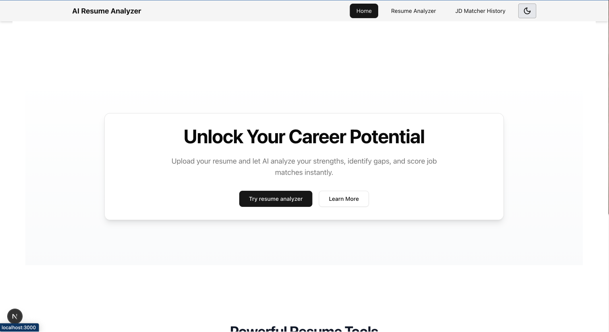
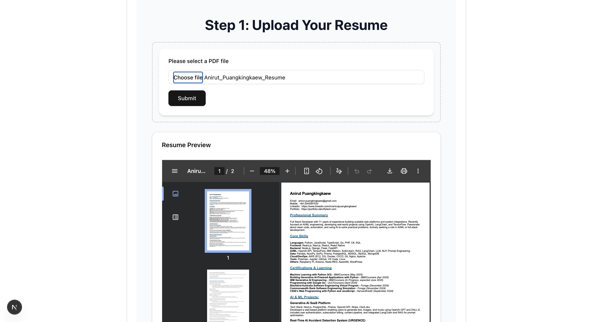
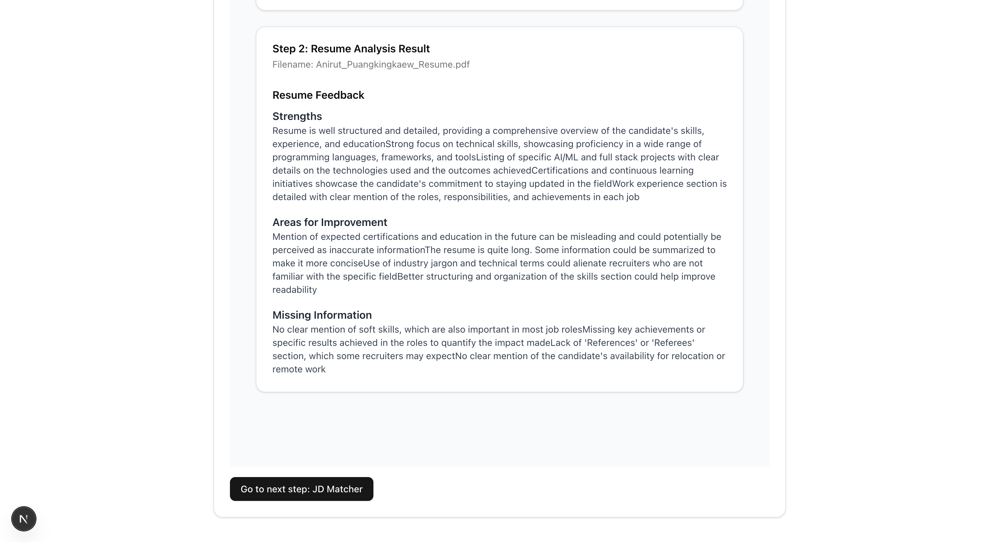
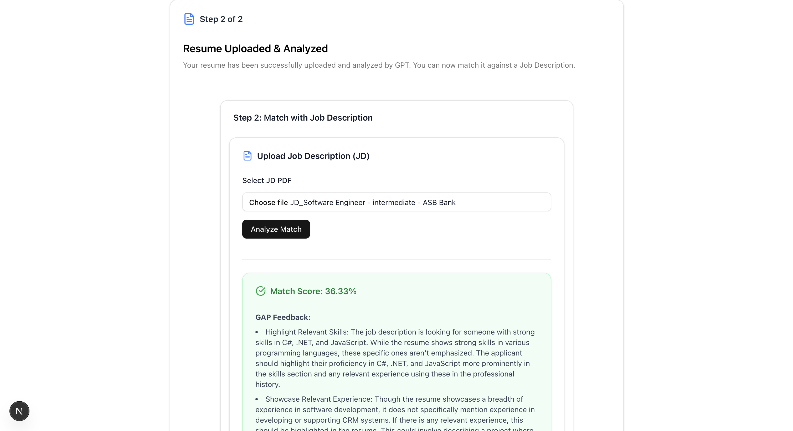
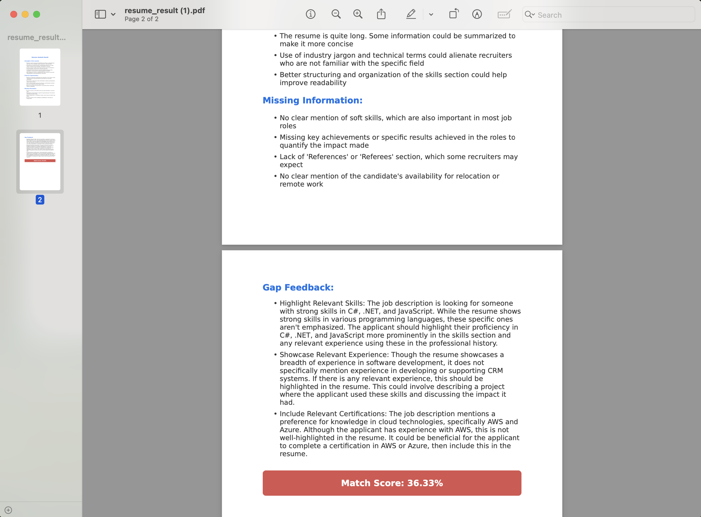

# AI Resume Analyzer

A lightweight tool powered by GPT and traditional NLP that helps users analyze resumes and match them against job descriptions, with feedback and improvement suggestions.


## Screenshot Preview

Here’s a look at the full workflow of AI Resume Analyzer:

<table>
  <tr>
    <td><br/>Homepage</td>
    <td><br/>Upload Resume</td>
    <td><br/>Resume Feedback</td>
  </tr>
  <tr>
    <td><br/>Match JD</td>
    <td><br/>Download PDF Result</td>
    <td><br/>History View</td>
  </tr>
</table>

## Features

-   📄 Upload PDF resumes

-   🔍 Extract skills, experience, and education using NLP

-   📊 Match resume against job descriptions with similarity scoring

-   ✨ Get GPT-powered suggestions and GAP feedback for better alignment with job descriptions

-   📁 Upload JD and resume for AI-based compatibility matching

-   🧪 Fully tested backend with mocked GPT feedback

-   💻 Modern, responsive frontend with Hero, Features, and Resume Upload sections

-   🌙 Dark Mode toggle with full Tailwind support using `next-themes` and custom CSS variables

-   📱 Responsive layout for desktop, tablet, and mobile with animated hamburger menu and ShadCN drawer

-   📚 Resume Analysis History stored locally with View / Re-analyze / Delete functionality and confirmation dialog

-   📦 Dockerized backend and frontend with shared environment support

-   📤 Show real-time progress bar and loading state during file upload

-   🧾 Preview uploaded PDF and display GPT feedback from backend

-   📥 Export GPT Feedback & Match Score as PDF/Markdown

-   📥 Download full history items as PDF or Markdown from the Resume History section

## UI Features

-   🌓 Use the top-right toggle in the Navbar to switch between Light and Dark Mode

-   🧠 Analyzer History is saved in your browser (localStorage)

-   📱 Responsive layout with animated hamburger menu and drawer

-   📄 One-click download of previously analyzed resume feedback

## Tech Stack

| Layer                  | Technology Stack                                                 |
| ---------------------- | ---------------------------------------------------------------- |
| Frontend (UI/UX)       | Next.js (App Router), React, TypeScript, Tailwind CSS, ShadCN UI |
| Backend / API          | FastAPI, Python, Docker, docker-compose                          |
| AI/NLP & Prompt        | OpenAI GPT-4, TfidfVectorizer                                    |
| PDF Parsing            | PyMuPDF                                                          |
| Testing / Productivity | Pytest, TestClient, Jest, Testing Library, Prettier, ESLint      |

## API Endpoints

#### `POST /api/upload`

Upload a resume (PDF), parse content, and get GPT feedback.  
Also returns extracted resume text and displays it in the frontend UI.

**FormData**:

-   `file`: PDF resume

**Response**:

```json
{
    "filename": "Anirut_Puangkingkaew_Resume.pdf",
    "resume_text": "Anirut Puangkingkaew\nEmail: anirut.puangkingkaew@gmail.com...",
    "resume_feedback": {
        "strengths": ["..."],
        "areas_for_improvement": ["..."],
        "missing_information": ["..."]
    }
}
```

#### `POST /api/match`

Match resume against a job description and receive suggestions.

**FormData**:

-   `jd_file`: Job description (PDF file)
-   `resume_text`: Extracted resume text from previous step

**Response**:

```json
{
    "match_score": 84.67,
    "gap_feedback": {
        "suggestions": [
            "1. Highlight Agile Experience...",
            "2. Emphasize Cloud-Based AI Services Experience...",
            "3. Specify Soft Skills..."
        ]
    }
}
```

#### `GET /api/export/pdf`

Export GPT feedback and match score as a PDF file. Requires `feedback` and `match_score` query parameters.

**Query Parameters**:

-   `feedback` (string): Feedback text to include in the export.
-   `match_score` (float): Match score to include in the export.

**Response**:

-   Returns a PDF file with the provided feedback and match score.

#### `GET /api/export/md`

Export GPT feedback and match score as a Markdown file. Requires `feedback` and `match_score` query parameters.

**Query Parameters**:

-   `feedback` (string): Feedback text to include in the export.
-   `match_score` (float): Match score to include in the export.

**Response**:

-   Returns a Markdown file with the provided feedback and match score.

## Running Tests

```bash
pytest
```

Tests include:

-   PDF parser validation

-   JD matching and score accuracy

-   Full upload & match flow

## Future Plans / Roadmap

-   ✅ Core: Resume Upload → GPT Feedback
-   ✅ JD Upload → Matching Score + GAP Analysis
-   ✅ PDF/Markdown Export + Dark Mode + Local History
-   🔄 Switchable LLM Mode (OpenAI or Hugging Face model)
-   🔜 Resume Comparison (Multiple Uploads)
-   🔜 Public Deploy on Vercel + Railway
-   🔜 Add login & save analysis history via database

## Project Structure

```
ai-resume-analyzer/
├── backend/
│   ├── app/
│   │   ├── main.py
│   │   ├── routes/
│   │   ├── services/
│   │   ├── template/
│   │   ├── tests/
│   │   └── utils/
├── frontend/
│   ├── public/
│   │   └── screenshots/
│   ├── src/
│   │   ├── api/
│   │   ├── app/
│   │   ├── components/
│   │   ├── hooks/
│   │   ├── lib/
│   │   ├── styles/
│   │   └── store/
├── docker-compose.yml
├── .env.example
└── README.md
```

## Local Setup

```bash
git clone https://github.com/aoddy10/ai-resume-analyzer.git
cd ai-resume-analyzer
cp .env.example .env
# Then edit the .env file to add your OpenAI API key and other environment variables
docker-compose up --build
# Access the frontend at http://localhost:3000
```

## Live Demo

This project is currently deployed privately for testing purposes. A public demo version is planned in the near future.

## License

MIT License © 2025 Anirut Puangkingkaew

For any questions or feedback, feel free to contact me at: anirut.puangkingkaew@gmail.com
