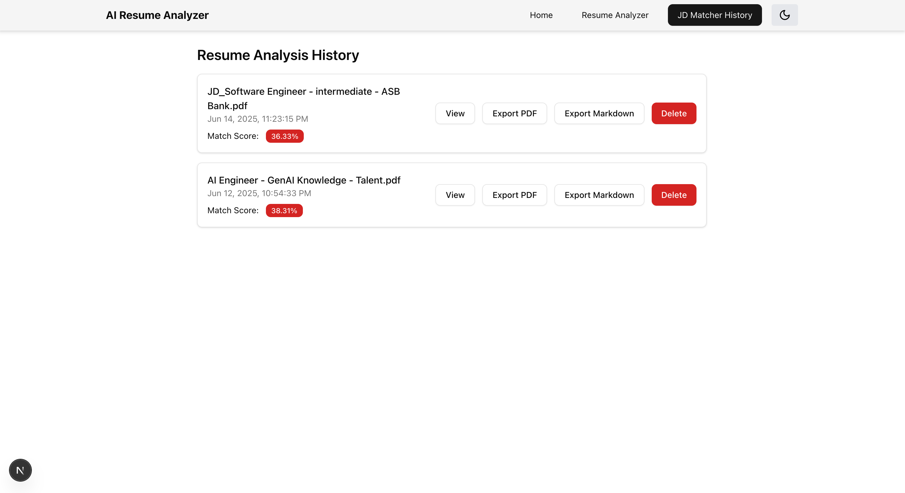

# AI Resume Analyzer

A GPT-powered application that analyzes resumes, matches them against job descriptions, and provides improvement suggestions — using semantic search and natural language generation.


## Screenshot Preview

Here’s a look at the full workflow of AI Resume Analyzer:

<table>
  <tr>
    <td><br/>Homepage</td>
    <td><br/>Upload Resume</td>
    <td><br/>Resume Feedback</td>
  </tr>
  <tr>
    <td><br/>Match JD</td>
    <td><br/>Download PDF Result</td>
    <td><br/>History View</td>
  </tr>
</table>

## Features

-   📄 Upload PDF resumes

-   🔍 Extract skills, experience, and education using NLP

-   📊 Match resume against job descriptions with similarity scoring

-   ✨ Get GPT-powered suggestions and GAP feedback for better alignment with job descriptions

-   📁 Upload JD and resume for AI-based compatibility matching

-   🧪 Fully tested backend with mocked GPT feedback

-   💻 Modern, responsive frontend with Hero, Features, and Resume Upload sections

-   🌙 Dark Mode toggle with full Tailwind support using `next-themes` and custom CSS variables

-   📱 Responsive layout for desktop, tablet, and mobile with animated hamburger menu and ShadCN drawer

-   📚 Resume Analysis History stored locally with View / Re-analyze / Delete functionality and confirmation dialog

-   📦 Dockerized backend and frontend with shared environment support

-   📤 Show real-time progress bar and loading state during file upload

-   🧾 Preview uploaded PDF and display GPT feedback from backend

-   📥 Export GPT Feedback & Match Score as PDF/Markdown

-   📥 Download full history items as PDF or Markdown from the Resume History section

## UI Features

-   🌓 Use the top-right toggle in the Navbar to switch between Light and Dark Mode

-   🧠 Analyzer History is saved in your browser (localStorage)

-   📱 Responsive layout with animated hamburger menu and drawer

-   📄 One-click download of previously analyzed resume feedback

## Tech Stack

| Layer                | Technology Stack                                                               |
| -------------------- | ------------------------------------------------------------------------------ |
| Frontend (UI/UX)     | Next.js (App Router), React, TypeScript, Tailwind CSS, ShadCN UI, Lucide Icons |
| Backend / API        | FastAPI, Python, Docker, docker-compose                                        |
| AI/NLP & Prompt      | OpenAI GPT-4, TfidfVectorizer, Cosine Similarity, LangChain PromptTemplate     |
| Data/Vector Store    | PostgreSQL, PGVector, PyMuPDF, Unstructured.io                                 |
| DevOps/Deploy        | GitHub Actions, Railway, Vercel, Fly.io (optional), Supabase (optional)        |
| Testing/Productivity | Pytest, Monkeypatch, TestClient, Jest, Testing Library, Prettier, ESLint       |

## API Endpoints

#### `POST /api/upload`

Upload a resume (PDF), parse content, and get GPT feedback.  
Also returns extracted resume text and displays it in the frontend UI.

**FormData**:

-   `file`: PDF resume

**Response**:

```json
{
    "filename": "Anirut_Puangkingkaew_Resume.pdf",
    "resume_text": "Anirut Puangkingkaew\nEmail: anirut.puangkingkaew@gmail.com...",
    "resume_feedback": {
        "strengths": ["..."],
        "areas_for_improvement": ["..."],
        "missing_information": ["..."]
    }
}
```

#### `POST /api/match`

Match resume against a job description and receive suggestions.

**FormData**:

-   `jd_file`: Job description (PDF file)
-   `resume_text`: Extracted resume text from previous step

**Response**:

```json
{
    "match_score": 84.67,
    "gap_feedback": {
        "suggestions": [
            "1. Highlight Agile Experience...",
            "2. Emphasize Cloud-Based AI Services Experience...",
            "3. Specify Soft Skills..."
        ]
    }
}
```

#### `GET /api/export/pdf`

Export GPT feedback and match score as a PDF file. Requires `feedback` and `match_score` query parameters.

**Query Parameters**:

-   `feedback` (string): Feedback text to include in the export.
-   `match_score` (float): Match score to include in the export.

**Response**:

-   Returns a PDF file with the provided feedback and match score.

#### `GET /api/export/md`

Export GPT feedback and match score as a Markdown file. Requires `feedback` and `match_score` query parameters.

**Query Parameters**:

-   `feedback` (string): Feedback text to include in the export.
-   `match_score` (float): Match score to include in the export.

**Response**:

-   Returns a Markdown file with the provided feedback and match score.

## Running Tests

```bash
pytest
```

Tests include:

-   PDF parser validation

-   GPT feedback with monkeypatch

-   JD matching and score accuracy

-   Full upload & match flow

## Future Plans / Roadmap

-   ✅ Phase 1: Resume Upload → Extract + GPT Feedback

-   ✅ Phase 2: JD Upload → Match Score + Gap Feedback

-   ✅ Phase 3: Export Result + Dark Mode + History

-   ⏳ Phase 4: Dual LLM Mode (HuggingFace + OpenAI)

-   ⏳ Phase 5: Multi-resume Comparison & API Integration

## Project Structure

```
ai-resume-analyzer/
├── backend/
│   ├── app/
│   │   ├── main.py
│   │   ├── routes/
│   │   ├── services/
│   │   ├── template/
│   │   ├── tests/
│   │   └── utils/
├── frontend/
│   ├── public/
│   │   └── screenshots/
│   ├── src/
│   │   ├── api/
│   │   ├── app/
│   │   ├── components/
│   │   ├── hooks/
│   │   ├── lib/
│   │   ├── styles/
│   │   └── store/
├── docker-compose.yml
├── .env.example
└── README.md
```

## Local Setup

```bash
git clone https://github.com/aoddy10/ai-resume-analyzer.git
cd ai-resume-analyzer
cp .env.example .env
# Then edit the .env file to add your OpenAI API key and other environment variables
docker-compose up --build
# Access the frontend at http://localhost:3000
```

## Live Demo

⚙️ Coming Soon — deploying on Vercel + Railway with dual LLM mode support.

## License

MIT License © 2025 Anirut Puangkingkaew

For any questions or feedback, feel free to contact me at: vobi69p@gmail.com
